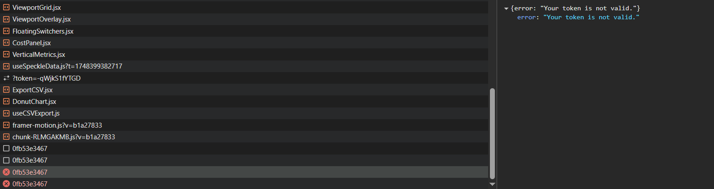

Absolutely! This is the best practice for future-proofing.
You want a **`useSpeckleData.js`** hook that returns the **exact same structure** as `useMockData`, so your UI works no matter which hook you swap in.

---

## **Step 1: Create `useSpeckleData.js`**

**In your `src/` folder, create a new file:**

```
src/useSpeckleData.js
```

**Paste this template:**

```jsx
import { useState } from "react";

// These lists should match your app's logic
const modeList = [
  "Workset – Assembly Line A",
  "Planning – Logistics",
  "Review – QA",
];
const zoneList = [
  "Zone 1 – Staging",
  "Zone 2 – Material Handling",
  "Zone 3 – Final Assembly",
];

export default function useSpeckleData() {
  // --- Project, Modes, Zones
  const [projectName, setProjectName] = useState("Gigafactory Austin – North Wing");
  const [modeIdx, setModeIdx] = useState(0);
  const [zoneIdx, setZoneIdx] = useState(0);

  // --- Static data (update with live Speckle data later)
  const [data] = useState({
    header: {
      facilityScore: 97,
      lastSynced: "just now",
    },
    cost: {
      equipmentCost: 2.43,
      materialCost: 1.68,
      totalCost: 4.11,
    },
    metrics: {
      clearance: 91,
      equipment: 157,
      circulation: 78,
      layoutScore: 87,
      euiScore: 42,
      estimatedWorkers: 320,
    }
  });

  // Functions for switching modes/zones
  const nextMode = () => setModeIdx(i => (i + 1) % modeList.length);
  const prevMode = () => setModeIdx(i => (i - 1 + modeList.length) % modeList.length);
  const nextZone = () => setZoneIdx(i => (i + 1) % zoneList.length);
  const prevZone = () => setZoneIdx(i => (i - 1 + zoneList.length) % zoneList.length);

  return {
    header: {
      ...data.header,
      projectName,
      setProjectName,
    },
    cost: data.cost,
    metrics: data.metrics,
    mode: modeList[modeIdx],
    zone: zoneList[zoneIdx],
    modes: modeList,
    zones: zoneList,
    setProjectName,
    nextMode,
    prevMode,
    nextZone,
    prevZone,
  };
}
```

---

## **Step 2: How to use it**

In `App.jsx`, simply change:

```jsx
import useMockData from "./useMockData";
```

**to**

```jsx
import useSpeckleData from "./useSpeckleData";
```

and then:

```jsx
const {
  header, cost, metrics,
  mode, zone, modes, zones,
  setProjectName, nextMode, prevMode, nextZone, prevZone
} = useSpeckleData();
```

*(Or use destructuring exactly as before.)*

---

## **Step 3: Integrating Live Data Later**

* You can update `useSpeckleData`’s state either with a polling function, event listener, or async fetch from the Speckle SDK.
* The UI and all components **will work unchanged** as long as the return object matches the same shape.

---

## **You are future-proofed and modular!**

If you want a "hot-swap" selector (dev toggle) for switching between mock and live data, let me know and I’ll give you the code.
When you’re ready to pull data from Speckle, just update the values inside `useSpeckleData.js`.

Let me know when you want to connect the SDK or wire up live listeners!


You'll see your project live at http://localhost:5173.

<iframe title="Speckle" src="https://app.speckle.systems/projects/4fbfe07d27/models/0fb53e3467#embed=%7B%22isEnabled%22%3Atrue%2C%22isTransparent%22%3Atrue%2C%22hideControls%22%3Atrue%2C%22hideSelectionInfo%22%3Atrue%2C%22disableModelLink%22%3Atrue%2C%22noScroll%22%3Atrue%7D" width="600" height="400" frameborder="0"></iframe>

<iframe title="Speckle" src="https://app.speckle.systems/projects/4fbfe07d27/models/0fb53e3467#embed=%7B%22isEnabled%22%3Atrue%2C%22isTransparent%22%3Atrue%2C%22hideControls%22%3Atrue%2C%22hideSelectionInfo%22%3Atrue%2C%22disableModelLink%22%3Atrue%2C%22noScroll%22%3Atrue%7D" width="600" height="400" frameborder="0"></iframe>

<iframe title="Speckle" src="https://app.speckle.systems/projects/4fbfe07d27/models/0fb53e3467#embed=%7B%22isEnabled%22%3Atrue%2C%22isTransparent%22%3Atrue%2C%22hideControls%22%3Atrue%2C%22hideSelectionInfo%22%3Atrue%2C%22disableModelLink%22%3Atrue%7D" width="600" height="400" frameborder="0"></iframe>

<iframe title="Speckle" src="https://app.speckle.systems/projects/4fbfe07d27/models/0fb53e3467#embed=%7B%22isEnabled%22%3Atrue%2C%22isTransparent%22%3Atrue%2C%22hideControls%22%3Atrue%2C%22hideSelectionInfo%22%3Atrue%2C%22disableModelLink%22%3Atrue%2C%22noScroll%22%3Atrue%2C%22manualLoad%22%3Atrue%7D" width="600" height="400" frameborder="0"></iframe>


Creating Your Own App


Welcome to this guide on how to Create your own App using Speckle. It's geared towards an audience that is familiar with Javascript and web development, or at least not scared by it!

In this example, we'll be creating a very simple web app capable of:

Authenticating a user through a Speckle server OAuth.
Search for stream's available to the user.
Display commit data associated with a given stream.
Filter the data to be displayed.
Cache results in localStorage to remember the app state across page reloads.
Let's get started! 🚀

Following along

If too busy to follow all the steps, you can find the entire code for this guide in this repository (opens new window).

Requirements
This guide should work in any platform (Mac/Linux/Windows). We'll be using VSCode as our IDE but you can use any other (even Notepad if your brave enough!).

You'll also need to have Node installed, as well as vue-cli and have some basic understanding of how Vue works.

Installing the prerequisites

Node: Probably the easiest way to manage your node installation is through nvm. On Windows, you can use this guide (opens new window). If on OSX, you can use the original nvm (opens new window).

Vue CLI: Once you have node installed, it's just a matter of running npm install -g @vue/cli.

Getting familiar with Vue

If you haven't used Vue before, don't worry. It's quite easy to get started with it - here's some docs (opens new window)you could run through beforehand.

We'll also be using some of Vue's most popular plugins: vuex and vue-router. If you're unfamiliar with them, they have great quick-start guides on their site!

vuex: Getting started(opens new window)
vue-router: Getting started(opens new window)
Setting up the Vue app
This is the simplest step. Open a new terminal, set the current directory to wherever you want the project to be located and run the following command:

vue create speckle-demo-app
This will ask you some questions, such as the version of vue to use, what plugins to install, etc. It is important that you answer the questions correctly, otherwise, your project may be missing some key features.

Vue setup - Step by step
TL;DR

If you are already familiar with this process, just select the same answers as the screenshot bellow:


Once done, you'd have your Vue project ready. To open the project in VSCode we just need to run:

code speckle-demo-app
WARNING

This step assumes you already installed VSCode in your path. If you haven't, there's a command for it in VSCode.


Install other dependencies
For our UI, we'll also be using Vuetify (opens new window)to make our life easier, as it has many useful components. To add it, run:

vue add vuetify
When asked for a preset, choose Default.

We'll also need to add a couple of handy dependencies such as vuex-persist for state storage, vue2-timeago to display user-friendly dates and debounce. For this, run the following command:

npm i vuex-persist vue2-timeago debounce
Run your app for the first time
If everything went well, running the following command should make the app available at http://localhost:8080.

npm run serve
In chrome, things should be looking like this:


Authenticating with the Server
Creating the Speckle files
For convenience, we're going to isolate all the speckle related code into 2 files:

src/speckleQueries.js will hold some utility functions to build our GraphQL queries.
src/speckleUtils.js will hold all call's to the Speckle server, as well as some constants. It will deal with login/logout functionality too.
Registering an Application on the Speckle Server
In order to be able to talk to our Speckle server, we first need to Create an App in that server with an existing account. To do that, visit the server's frontend https://app.speckle.systems (opens new window), log in with your account and visit the profile page.

Scroll down until you see the Applications section, and press the New App button. A pop-up should appear, fill it in as follows:

Name: SpeckleDemoApp
Scopes: stream:read, profile:read, profile:email
Redirect url: http://localhost:8080
Description: My first speckle app
Once accepted, you'll see the App Id and App Secret, as well as an indication to the url pattern we should use (https://app.speckle.systems/authn/verify/{appId}/{challenge}).

WARNING

Note that the redirect url points to our local computer network. When deploying this app to a service like Netlify, we'll have to create a new one pointing to the correct Netlify url.

Saving app credentials as ENV variables
The App Id and App Secret are used to identify your app, so you should never add them to your version control. Instead, we'll be using ENV variables to save that information, which also allows us to modify it in different scenarios (development/production).

TIP

For those of you who wonder, frontend applications that integrate with the Speckle Server are treated as OAuth public applications, because they cannot keep their id and secret safe.

Vue will automatically read any .env files in the root of your project and load the variables accordingly, but will also replace all references with the actual value of the variable on compilation (which we do not want). We can tell vue.js to not do this by creating a file named .env.local instead. The contents should look like this 👇🏼 (remember to replace your ID and Secret appropriately).

# The Speckle Application Id
VUE_APP_SPECKLE_ID=YOUR_APP_ID 

# The Speckle Application Secret
VUE_APP_SPECKLE_SECRET=YOUR_APP_SECRET

VUE_APP_SERVER_URL=https://app.speckle.systems
VUE_APP_SPECKLE_NAME="Speckle Demo App"
Login in with Speckle
A simplified version of the auth flow with a Speckle Server can be summarised as follows:

User clicks the Login button
User is redirected to the auth page in the Speckle server (using the provided url pattern when creating an application)
User will log in and allow the app to access their data (hopefully?).
User is redirected to our specified Redirect URL, with an attached access_code.
Using that access code, we can exchange it for a pair of token/refresh token, which is what allows the app to "talk" to the server as that user. We'll save those in localStorage.
This may sound rather complicated, but it boils down to 2 different interactions (redirect your user and exchange the access code).

Adding auth functions to speckleUtils.js
In our src/speckleUtils.js file, paste in the following code. You'll find some constants that refer to our previously set ENV variables, as well as several functions.

goToSpeckleAuthPage: Will generate a random challenge, save it in localStorage and direct the url to the auth page in the specified speckle server.
exchangeAccessCode: Will fetch from the server a new pair of token/refresh token and clear the challenge.
speckleLogOut: Will erase all necessary data from localStorage.
TIP

Note that goToSpeckleAuthPage saves the challenge, and exchangeAccessCode uses that same challenge to exchange the tokens. If the challenge used doesn't match, the request will fail.

speckleUtils.js
Linking to vuex
Since we're using vuex to manage the state of our application, we'll also add the redirect, exchange and logout logic as actions. We can then invoke them in any of our application components.

Replace the contents of the file src/store/index.js with the following:

store/index.js
We can now use these actions in any component by calling this.$store.dispatch(ACTION_NAME, ...params).

Add Log In/Log Out buttons
In your App.vue file, replace it's contents with the following:

App.vue
Following along?

If you are following this step by step and not working with a clone of the final code, you should now add the image referenced in the code above to the src/assets/img.png path. You can grab just that file here (opens new window).

Notice there's an isAuthenticated computed property that defaults to false for now (we'll update it later). There's also a pair of v-btn buttons linked to this boolean value. When there is no user authenticated, we'll show the login button, and when there is a user authenticated, we'll show the Log Out button.

Each is bound to the actions in the store we created earlier.

<v-btn
  outlined
  v-if="!isAuthenticated"
  @click="$store.dispatch('redirectToAuth')"
>
  <span>Login with Speckle</span>
</v-btn>
<v-btn outlined v-else @click="$store.dispatch('logout')">
  Log out
</v-btn>
At this point in time, your App should display only a menu bar with the title and the Log In button.


Now press the Log In button, follow the steps in the server and allow the app to access your data. This will take you back to http://localhost:8080. But notice the url will now contain a trailing ?access_code=YOUR_ACCESS_CODE, we can now edit our src/router/index.js file to exchange the access code whenever it finds one.


Exchange the access_code
In order to exchange the access code automatically whenever it is provided in the url, we're going to use one of vue-router's features. vue-router is the plugin that handles url routes in your app, it also parses query values and url parameters so you won't have to.

We can implement a beforeEach handler, that will allow us to run some code right before each page is loaded in our app. At this point, we'll check if it contains an access code and if so, exchange it.

Open your src/router/index.js file and add this code right above the export default router line.

// This import can go at the top of the file
import store from '@/store'

router.beforeEach(async (to, from, next) => {
  if (to.query.access_code) {
    // If the route contains an access code, exchange it
    try {
      await store.dispatch("exchangeAccessCode", to.query.access_code)
    } catch (err) {
      console.warn("exchange failed", err)
    }
    // Whatever happens, go home.
    next("/")
  }
})
Now, press the Log In button again, allow the app to access your account and wait for the redirect to the app. Once it's done, you should have 2 variables stored in localStorage: Speckle Demo App.AuthToken and Speckle Demo App.RefreshToken

At this point, we've managed to save our authentication token but our app still cannot discern if your users are authenticated or not (remember the isAuthenticated computed property in App.vue). We'll add this on the next step.

Fetching user data
In order for our app to know who we are, it needs to fetch our user's data. The best place to fetch, and store, this data, is in our store.

User data query
Add the following function to our speckleQueries.js file. This is the graphQL query that will fetch the user and server info.

export const userInfoQuery = () => `query {
      user {
        name
      },
      serverInfo {
        name
        company
      }
    }`
Add this to the src/speckleUtils.js file. Remember to import userInfoQuery.

import { userInfoQuery } from "@/speckleQueries"

// Calls the GraphQL endpoint of the Speckle server with a specific query.
export async function speckleFetch(query) {
  let token = localStorage.getItem(TOKEN)
  if (token)
    try {
      var res = await fetch(`${SERVER_URL}/graphql`, {
        method: "POST",
        headers: {
          Authorization: "Bearer " + token,
          "Content-Type": "application/json"
        },
        body: JSON.stringify({
          query: query
        })
      })
      return await res.json()
    } catch (err) {
      console.error("API call failed", err)
    }
  else return Promise.reject("You are not logged in (token does not exist)")
}

// Fetch the current user data using the userInfoQuery
export const getUserData = () => speckleFetch(userInfoQuery())
Modify app store
Replace the contents of your src/store/index.js with the following code:

store/index.js
Update App.vue
Now, in the App.vue file, modify the isAuthenticated computed property as shown:

    isAuthenticated() {
      return this.$store.getters.isAuthenticated
    }
Also, in the template section, add the following on top of the Login/Logout buttons

<div v-if="isAuthenticated">
  Welcome
  <b>{{ $store.state.user.name }}</b>
  ! You are connected to
  <b>
    {{ $store.state.serverInfo.company }}'s
    <em>{{ $store.state.serverInfo.name }}</em>
  </b>
</div>

<v-spacer></v-spacer>
Update router.beforeEach
The only thing left to do is to also tell the router to check the user on every page change. For this, modify the beforeEach implementation by adding an else clause to our previous condition

router.beforeEach(async (to, from, next) => {
  if (to.query.access_code) {
    // If the route contains an access code, exchange it
    try {
      await store.dispatch("exchangeAccessCode", to.query.access_code)
    } catch (err) {
      console.warn("exchange failed", err)
    }
    // Whatever happens, go home.
    next("/")
  } else {
    try {
      // Check on every route change if you still have access.
      var goto = await store.dispatch("getUser")
      next(goto)
    } catch (err) {
      next("/")
    }
  }
})
That should do it! Now, if you refresh the page you should see a welcome message with your user name and the server name you connected to, as well as the Log Out button:


Searching for streams
Now that we have access to our user and server data in our app, and also distinguish when a user is logged in or not, we can start fetching other info from our server. Let's start with a stream search field. The selected stream will also be stored in vuex, so we'll also add the appropriate state props, methods and actions to it.

Search query
Start by adding the following function to our speckleQueries.js

export const streamSearchQuery = search => `query {
      streams(query: "${search}") {
        totalCount
        cursor
        items {
          id
          name
          updatedAt
        }
      }
    }`
Then add the following function to speckleUtils.js. We'll use it to fetch the search results in our SpeckleSearch component (2 steps below)

// Update the import to include the streamSearchQuery
import { userInfoQuery, streamSearchQuery } from "@/speckleQueries"

export const searchStreams = e => speckleFetch(streamSearchQuery(e))
Modify app store
Modify src/store/index.js as shown in the following code block. We've just added a currentStream property to the state, a setCurrentStream mutation and two actions, handleStreamSelection and clearStreamSelection. This will allow us to save the user selection in our app state.

store/index.js
Create child components
Now we'll create a new component called StreamSearch.vue to handle all the search UI in one place.

StreamSearch.vue
Create also a simple WelcomeView.vue to show to our non-authenticated users.

WelcomeView.vue
Update Home.vue
Modify the Home.vue view.

Home.vue
Update App.vue
In App.vue there is a commented line referencing the <router-view/>. Uncomment it.

Preview results
After making these changes, your app should display a welcome message when not logged in and the search bar and selection text when logged in.

Introducing some text into the search bar should display a list of results in a dropdown. Selecting one of the result items will change the selection text from No stream selected to display the selected Stream name and id, as well as 2 buttons. The first one will take you to the stream page in the server, while the second one will clear the selection in the app state.


Displaying stream commits
So far, we've managed to authenticate with our Speckle server, fetch user and server information and search for available streams, as well as storing the results in our app state.

Now, let's use our selectedStream to display a table with all it's commits, as well as some data associated with each commit. Since the commit list can be rather large, we'll be adding basic pagination functionality to the table.

For that, we'll need to fetch the commit data associated with the stream, modify our store/index.js to hold that new data, and add a table view with a column filter on Home.vue

Create fetch query
Let's start by adding a new query function to our speckleQueries.js

export const streamCommitsQuery = (streamId, itemsPerPage, cursor) => `query {
    stream(id: "${streamId}"){
      commits(limit: ${itemsPerPage}, cursor: ${
  cursor ? '"' + cursor + '"' : null
}) {
        totalCount
        cursor
        items{
          id
          message
          branchName
          sourceApplication
          referencedObject
          authorName
          createdAt
        }
      }
    }
  }`
And add the following to speckleUtils.js (remember to import the streamCommitsQuery)

export const getStreamCommits = (streamId, itemsPerPage, cursor) =>
  speckleFetch(streamCommitsQuery(streamId, itemsPerPage, cursor))
Notice that the query has a cursor. This is used to get successive pages of the commits list. There is a current limitation with the cursor, as it only allows to go forward in pages, not backward. To fix this, we'll keep track of these values in our store so we can have pagination going forward (we'll also keep the itemsPerPage value fixed to keep things simple).

Update store/index.js
Now, there's quite a bit of modifications in the store/index.js file. I've highlighted the changes in the code block, but feel free to replace the whole content for the one bellow.

We basically need modify the state to be able to:

Store the latestCommits data, a list of previousCursors and a list of tableOptions for the table visualization.
Add mutations to modify individually each of these state properties (note that previousCursors is a list, so we added two mutations: one to push a new value and another to replace the entire list)
Add getCommits action, and update logout, handleStreamSelection and clearStreamSelection to also deal with these new props.
store/index.js
Update Home.vue
The Home.vue also requires some major additions, so I've highlighted the changes in the code block, but just as the step below, feel free to replace the entire content if you're playing it fast and loose!

We need to do the following modifications:

Add a new div for the table view containing a v-select and a v-data-table.
The v-select allows to select the available keys to display as table columns
The v-data-table does all the table UI magic so we don't have to.
Add several computed properties:
commits and previousCursors to fetch the data from our store
availableKeys and filteredHeaders are helper functions to extract all available keys from the received commit data and format the headers the way v-data-table likes them.
Add new data properties to the component:
options will serve to keep the table options in sync
selectedKeys is where we'll save the user selected information to display as columns in the table. It is initialized with some values already.
Add a watch function for options:
I will get called every time the table options change. This is where we check if a page change has been requested, and tell the store to fetch new data if necessary.
We also added some css magic to hide the itemsPerPage selection button, as this demo will have a fixed page size.
Home.vue
Preview result
That should cover all the changes needed! Go ahead to http://localhost:8080. If logged in, your app should be looking like this 👇🏼


Adding data persistence
Our app seems to be working fine, but there's still a small adjustment that we can do to make things better. If, for any reason, a user reloads the page, they will loose their current stream selection + commit results, which is annoying. Let's fix that!

Thankfully, we only need to modify the store/index.js file slightly to make this happen. We already installed vuex-persist, the plugin that will do all the heavy lifting for us.

First, import vuex-persist:

import VuexPersistence from "vuex-persist"
then create an instance (you'll need to import APP_NAME from speckleUtils.js) that uses localStorage. We could also use sessionStorage, which would be deleted at the end of the session.

const vuexLocal = new VuexPersistence({
  storage: window.localStorage,
  key: `${APP_NAME}.vuex`
})
add a plugins property to the Vuex.Store constructor config:

export default new Vuex.Store({
  plugins: [vuexLocal.plugin],
  ...
})
and that's it! Your app should now persist the app state across page refresh. 🚀

Publish to Netlify
Now that we have our app up and running locally, there's just one last thing to do: deploy it!

We'll be using Netlify for this guide, but you could also as easily use Heroku, or any other platforms that supports web-app s like Vue.js out of the box.

First, you'll need a GitHub account to push your app's repo to, and a Netlify account. If you haven't got a netlify account yet, you can log in with your GitHub account, which will make your life easier.

Create your site
Go to your Netlify's dashboard and find the New site from Git button 
Follow the steps as shown:


Once this is done, you'll have a netlify url where you're app will live.
Create a new Application on the Speckle server and set it's callback url to the application url you just got from Netlify. This will give you a new appId and appSecret.
Last step is to set the env variables, similar to how we did it for our development server.
Go to Site Settings->Build and Deploy-Environment
Add the same environment variables as in your .env.local file but using the appId and appSecret values from step 3. 
Go to the Deploys section of your app, find the Trigger Deploy button and select the Deploy Site option. This will force your app to restart and detect the new env variables.
That's it! If you visit your netlify url, you should see your app running smoothly!

Wrapping it up
We've covered quite a lot on this guide, but this was only a small example of interacting with Speckle streams and commits. Expanding on this further can move onto using the Speckle Viewer, fetch the data inside commits, receive notifications from the server, and more!

Code Repository

You can find the entire code for this guide in this repository.(opens new window)

If you find any issues with this guide, or the apps code, feel free to report them on our Community Forum (opens new window)or directly on the app's GitHub repo. Wherever it feels more appropriate.


localhost/:1 Access to fetch at 'https://app.speckle.systems/projects/4fbfe07d27/models/0fb53e3467' from origin 'http://localhost:5177' has been blocked by CORS policy: Response to preflight request doesn't pass access control check: No 'Access-Control-Allow-Origin' header is present on the requested resource.

git clone git@github.com:specklesystems/speckle-server.git or, alternatively git clone https://github.com/specklesystems/speckle-server.git
cd speckle-server
corepack enable
yarn
yarn build
yarn dev:docker:up
cp packages/server/.env.example packages/server/.env
cp packages/server/.env.test-example packages/server/.env.test
cp packages/frontend-2/.env.example packages/frontend-2/.env
cp packages/dui3/.env.example packages/dui3/.env
yarn dev

useSpeckleData.js:105 
 GET https://app.speckle.systems/api/v1/projects/4fbfe07d27/models/0fb53e3467 403 (Forbidden)
fetchData	@	useSpeckleData.js:105
(anonymous)	@	useSpeckleData.js:160
commitHookEffectListMount	@	chunk-SVG7M4VJ.js?v=b1a27833:16961
commitPassiveMountOnFiber	@	chunk-SVG7M4VJ.js?v=b1a27833:18204
commitPassiveMountEffects_complete	@	chunk-SVG7M4VJ.js?v=b1a27833:18177
commitPassiveMountEffects_begin	@	chunk-SVG7M4VJ.js?v=b1a27833:18167
commitPassiveMountEffects	@	chunk-SVG7M4VJ.js?v=b1a27833:18157
flushPassiveEffectsImpl	@	chunk-SVG7M4VJ.js?v=b1a27833:19541
flushPassiveEffects	@	chunk-SVG7M4VJ.js?v=b1a27833:19498
(anonymous)	@	chunk-SVG7M4VJ.js?v=b1a27833:19379
workLoop	@	chunk-SVG7M4VJ.js?v=b1a27833:195
flushWork	@	chunk-SVG7M4VJ.js?v=b1a27833:174
performWorkUntilDeadline	@	chunk-SVG7M4VJ.js?v=b1a27833:382



